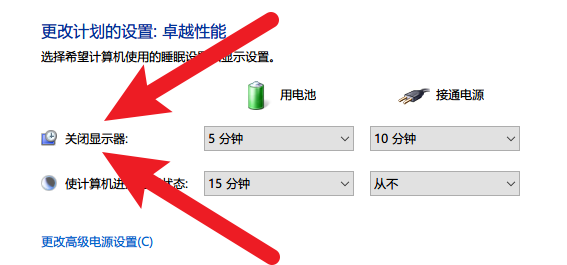

# TurnOffMonitor 关闭显示器

**Windows Only 仅支持 Windows**

TurnOffMonitor is a simple program that actively turns off the monitor.

用于主动关闭显示器的一个程序。

## Usage 使用方法

1. Download the [latest release](https://github.com/AkagiYui/TurnOffMonitor/releases/latest)

2. Run `TurnOffMonitor.exe`

## Thanks 致谢

https://www.codeproject.com/Articles/12794/Complete-Guide-on-How-To-Turn-A-Monitor-On-Off-Sta

https://stackoverflow.com/questions/713498/turn-on-off-monitor
